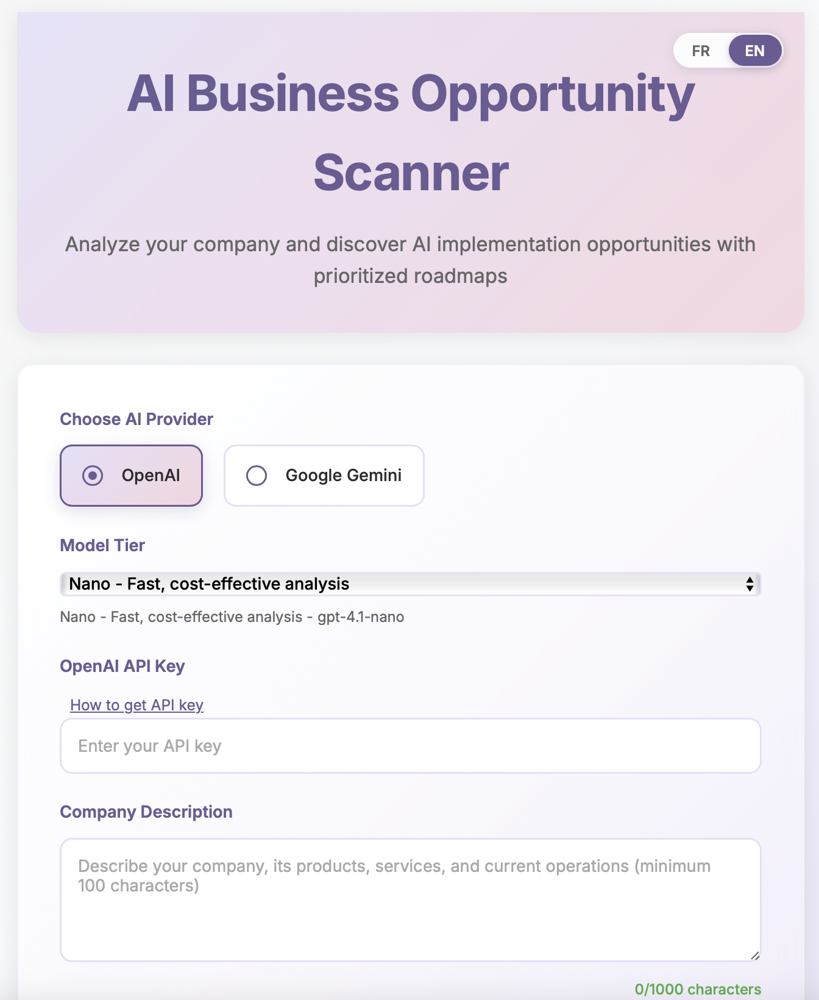
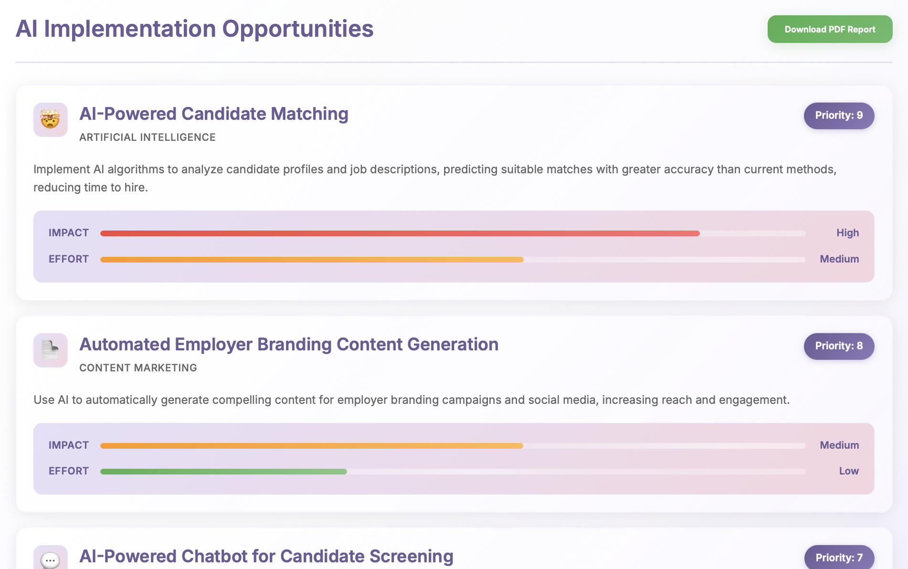
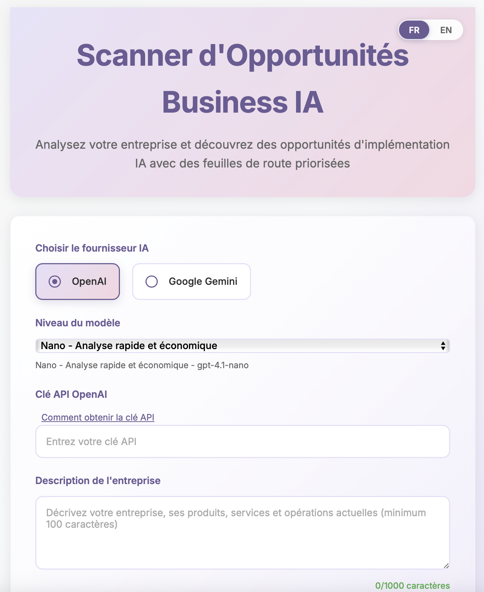
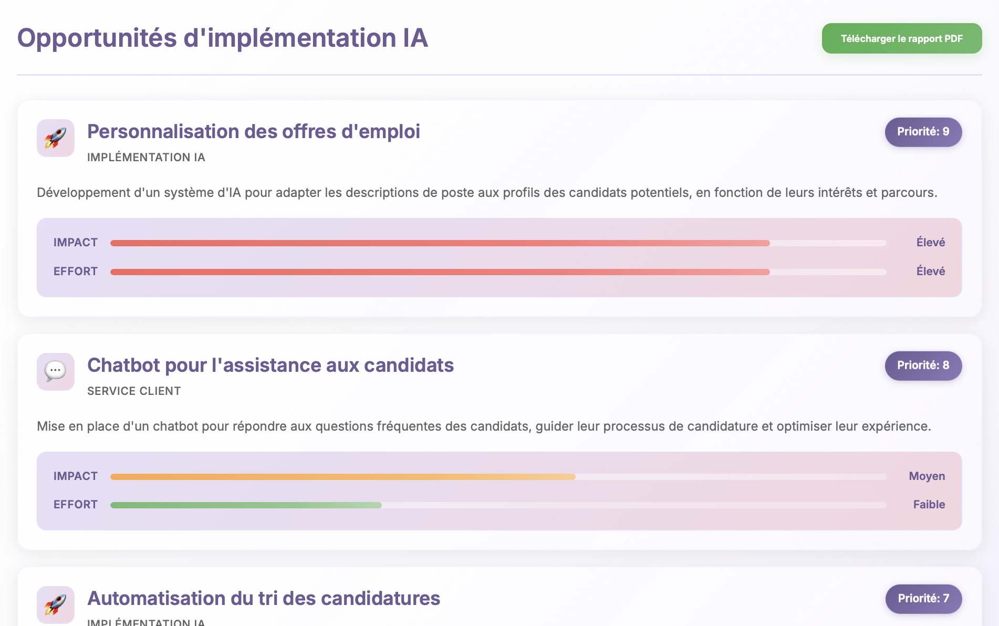

# AI Business Opportunity Scanner 🚀

*[English](#english) | [Français](#français)*

---

## English


*Clean, intuitive interface for easy AI provider selection and company analysis*

### 🌟 Overview

The **AI Business Opportunity Scanner** is a powerful MVP application that analyzes company descriptions and generates AI implementation opportunities with prioritized roadmaps. Built with cutting-edge AI technology, it supports both OpenAI and Google Gemini APIs across three model tiers for optimal performance and cost-effectiveness.

### ✨ Features

- **Multi-AI Provider Support**: Choose between OpenAI and Google Gemini
- **Three Model Tiers**: 
  - 🏃‍♂️ **Nano**: Fast, cost-effective analysis
  - ⚖️ **Mini**: Balanced performance
  - 🎯 **Standard**: Most comprehensive analysis
- **File Upload Support**: Analyze text files (.txt) and PDFs (up to 5MB)
- **Smart Analysis**: Generates 3-5 AI opportunities with impact/effort scoring
- **PDF Reports**: Download comprehensive implementation roadmaps
- **Multilingual Support**: English and French interface
- **Responsive Design**: Works seamlessly on desktop and mobile

### 🛠️ Technology Stack

- **Backend**: Node.js, Express.js
- **Frontend**: HTML5, CSS3, JavaScript (ES6+)
- **AI Integration**: OpenAI GPT-4, Google Gemini
- **File Processing**: Multer for uploads
- **PDF Generation**: PDFKit
- **Deployment**: Vercel-ready

### 🚀 Quick Start

#### Prerequisites
- Node.js 18+
- npm or yarn

#### Installation

```bash
# Clone the repository
git clone https://github.com/yourusername/ai-business-opportunity-scanner.git
cd ai-business-opportunity-scanner

# Install dependencies
npm install

# Start the development server
npm start
```

The application will be available at `http://localhost:3000`

#### API Keys

No environment setup required! The application prompts users to input their API keys directly in the interface:
- OpenAI API Key (for GPT models)
- Google Gemini API Key (for Gemini models)

API keys are sent securely with each request and are not stored on the server.

**How to Get Your API Keys:**

**For OpenAI:**
1. Visit [OpenAI Platform](https://platform.openai.com/) and sign in
2. Click on your profile icon → "API Keys"
3. Click "Create new secret key" and give it a name
4. Copy the generated key immediately (you won't see it again!)

**For Google Gemini:**
1. Visit [Google AI Studio](https://aistudio.google.com/prompts/new_chat) and sign in
2. Click "Get API Key" in the top right corner
3. Select "Create API key in new project" or choose existing project
4. Copy the generated key for use in the application

💡 **Tip**: Click the "How to get API key" link next to the API key field in the app for step-by-step instructions!

### 📊 Model Mapping

| Tier | OpenAI Model | Google Gemini Model |
|------|-------------|-------------------|
| Nano | gpt-4.1-nano | gemini-1.5-flash-8b |
| Mini | o4-mini | gemini-1.5-flash |
| Standard | gpt-4.1 | gemini-1.5-pro |

### 🎯 Usage

1. **Select AI Provider**: Choose between OpenAI or Google Gemini
2. **Enter API Key**: Input your chosen provider's API key
3. **Choose Model Tier**: Select based on your needs (speed vs. comprehensiveness)
4. **Input Company Description**: 
   - Type directly into the text area
   - Upload a .txt or .pdf file
5. **Generate Analysis**: Click "Analyze Opportunities"
6. **Review Results**: Browse the generated AI opportunities
7. **Download Report**: Get a comprehensive PDF roadmap

#### Generated AI Opportunities

*Detailed AI implementation opportunities with impact/effort scoring*

### 🗂️ Project Structure

```
ai-business-opportunity-scanner/
├── server.js              # Main Express server
├── index.html             # Frontend application
├── package.json           # Dependencies and scripts
├── uploads/               # Temporary file storage
├── CLAUDE.md             # AI assistant instructions
└── README.md             # This file
```

### 🚀 Deployment

This application is optimized for Vercel deployment:

```bash
# Deploy to Vercel
npm install -g vercel
vercel --prod
```

### 📝 API Endpoints

- `GET /` - Serves the main application
- `POST /api/analyze` - Analyzes company descriptions
- `GET /api/download/:id` - Downloads PDF reports

### 🤝 Contributing

1. Fork the repository
2. Create a feature branch (`git checkout -b feature/amazing-feature`)
3. Commit your changes (`git commit -m 'Add amazing feature'`)
4. Push to the branch (`git push origin feature/amazing-feature`)
5. Open a Pull Request

### 📄 License

This project is licensed under the ISC License.

---

## Français


*Interface intuitive et épurée pour une sélection facile du fournisseur IA et l'analyse d'entreprise*

### 🌟 Aperçu

Le **Scanner d'Opportunités Business IA** est une application MVP puissante qui analyse les descriptions d'entreprises et génère des opportunités d'implémentation IA avec des feuilles de route priorisées. Construit avec une technologie IA de pointe, il supporte les APIs OpenAI et Google Gemini à travers trois niveaux de modèles pour une performance et une rentabilité optimales.

### ✨ Fonctionnalités

- **Support Multi-Fournisseur IA**: Choisissez entre OpenAI et Google Gemini
- **Trois Niveaux de Modèles**:
  - 🏃‍♂️ **Nano**: Analyse rapide et économique
  - ⚖️ **Mini**: Performance équilibrée
  - 🎯 **Standard**: Analyse la plus complète
- **Support de Téléchargement de Fichiers**: Analysez des fichiers texte (.txt) et PDF (jusqu'à 5MB)
- **Analyse Intelligente**: Génère 3-5 opportunités IA avec notation impact/effort
- **Rapports PDF**: Téléchargez des feuilles de route d'implémentation complètes
- **Support Multilingue**: Interface en anglais et français
- **Design Responsive**: Fonctionne parfaitement sur desktop et mobile

### 🛠️ Stack Technologique

- **Backend**: Node.js, Express.js
- **Frontend**: HTML5, CSS3, JavaScript (ES6+)
- **Intégration IA**: OpenAI GPT-4, Google Gemini
- **Traitement de Fichiers**: Multer pour les uploads
- **Génération PDF**: PDFKit
- **Déploiement**: Prêt pour Vercel

### 🚀 Démarrage Rapide

#### Prérequis
- Node.js 18+
- npm ou yarn

#### Installation

```bash
# Cloner le dépôt
git clone https://github.com/yourusername/ai-business-opportunity-scanner.git
cd ai-business-opportunity-scanner

# Installer les dépendances
npm install

# Démarrer le serveur de développement
npm start
```

L'application sera disponible à `http://localhost:3000`

#### Clés API

Aucune configuration d'environnement requise ! L'application demande aux utilisateurs de saisir leurs clés API directement dans l'interface :
- Clé API OpenAI (pour les modèles GPT)
- Clé API Google Gemini (pour les modèles Gemini)

Les clés API sont envoyées de manière sécurisée avec chaque requête et ne sont pas stockées sur le serveur.

**Comment obtenir vos clés API :**

**Pour OpenAI :**
1. Visitez [OpenAI Platform](https://platform.openai.com/) et connectez-vous
2. Cliquez sur votre icône de profil → "API Keys"
3. Cliquez sur "Create new secret key" et donnez-lui un nom
4. Copiez la clé générée immédiatement (vous ne la verrez plus !)

**Pour Google Gemini :**
1. Visitez [Google AI Studio](https://aistudio.google.com/prompts/new_chat) et connectez-vous
2. Cliquez sur "Get API Key" dans le coin supérieur droit
3. Sélectionnez "Create API key in new project" ou choisissez un projet existant
4. Copiez la clé générée pour l'utiliser dans l'application

💡 **Astuce** : Cliquez sur le lien "Comment obtenir la clé API" à côté du champ clé API dans l'app pour des instructions étape par étape !

### 📊 Mapping des Modèles

| Niveau | Modèle OpenAI | Modèle Google Gemini |
|--------|---------------|---------------------|
| Nano | gpt-4.1-nano | gemini-1.5-flash-8b |
| Mini | o4-mini | gemini-1.5-flash |
| Standard | gpt-4.1 | gemini-1.5-pro |

### 🎯 Utilisation

1. **Sélectionner le Fournisseur IA**: Choisissez entre OpenAI ou Google Gemini
2. **Saisir la Clé API**: Entrez la clé API du fournisseur choisi
3. **Choisir le Niveau de Modèle**: Sélectionnez selon vos besoins (vitesse vs. exhaustivité)
4. **Saisir la Description de l'Entreprise**:
   - Tapez directement dans la zone de texte
   - Téléchargez un fichier .txt ou .pdf
5. **Générer l'Analyse**: Cliquez sur "Analyser les Opportunités"
6. **Examiner les Résultats**: Parcourez les opportunités IA générées
7. **Télécharger le Rapport**: Obtenez une feuille de route PDF complète

#### Opportunités IA Générées

*Opportunités d'implémentation IA détaillées avec notation impact/effort*

### 🗂️ Structure du Projet

```
ai-business-opportunity-scanner/
├── server.js              # Serveur Express principal
├── index.html             # Application frontend
├── package.json           # Dépendances et scripts
├── uploads/               # Stockage temporaire de fichiers
├── CLAUDE.md             # Instructions assistant IA
└── README.md             # Ce fichier
```

### 🚀 Déploiement

Cette application est optimisée pour le déploiement Vercel:

```bash
# Déployer sur Vercel
npm install -g vercel
vercel --prod
```

### 📝 Points de Terminaison API

- `GET /` - Sert l'application principale
- `POST /api/analyze` - Analyse les descriptions d'entreprises
- `GET /api/download/:id` - Télécharge les rapports PDF

### 🤝 Contribution

1. Forkez le dépôt
2. Créez une branche feature (`git checkout -b feature/fonctionnalite-incroyable`)
3. Commitez vos changements (`git commit -m 'Ajouter fonctionnalité incroyable'`)
4. Poussez vers la branche (`git push origin feature/fonctionnalite-incroyable`)
5. Ouvrez une Pull Request

### 📄 Licence

Ce projet est sous licence ISC.

---

## 🌟 Demo

Experience the power of AI-driven business analysis at: [Your Vercel URL]

*Découvrez la puissance de l'analyse business pilotée par l'IA à: [Votre URL Vercel]*

## 🔗 Links | Liens

- 🌐 [Live Demo | Démo en Direct](https://your-vercel-url.vercel.app)
- 📖 [Documentation](https://github.com/yourusername/ai-business-opportunity-scanner/wiki)
- 🐛 [Report Issues | Signaler des Problèmes](https://github.com/yourusername/ai-business-opportunity-scanner/issues)

---

*Made with ❤️ by [Your Name] | Fait avec ❤️ par [Votre Nom]*